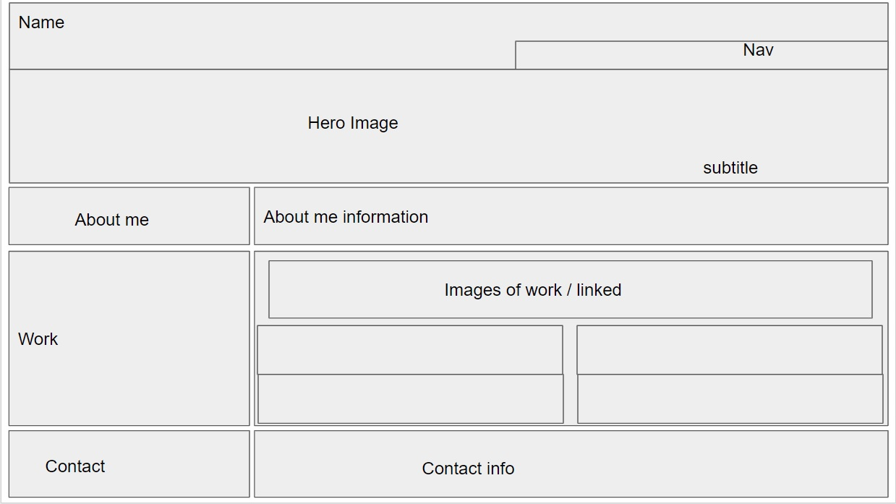
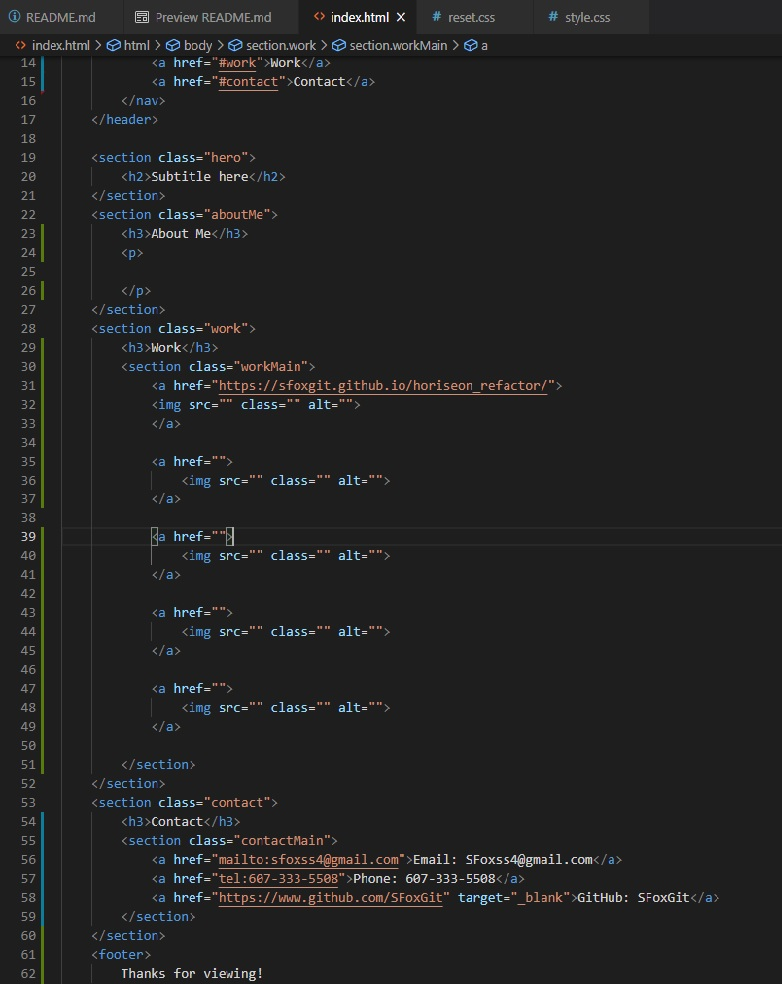
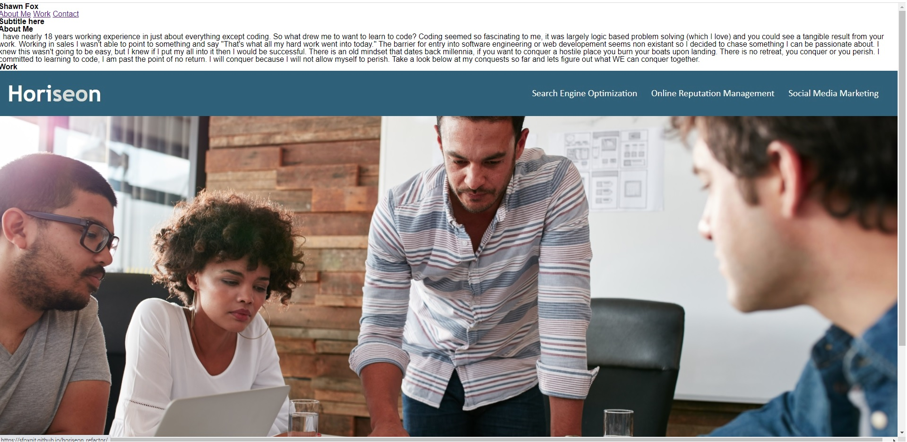

# shawn_fox_portfolio
My personal portfolio to be updated as I continue my learning.

---
## Table of Contents

- [Description](##Description)

- [Requirements](##Requirements)

- [Progress](##Progress)

- [Installation](##Installation)

- [Contributions](##Contributing)

- [Credits](##Credits)

---
## Description

---
## Requirements

### Must include:

    - Name

    - Photo

    - Links to 

    - Sections about me

    - My work

    - Contact information

    - Nav links UI scrolls to corresponding section

    - My work section must have titled images of my applications

    - My first project must be a larger image than the rest

    - Clicking on image links to deployed application

    - Page must be adaptive to to various screen sizes
    
---
## Progress

Stage 1: Planning

I was provided an example criteria for layout purposes. In google slides I did a rough draft of it to ease the process when it comes to html and css.

Stage 2: Basic html framework

Sectioning off each area based off the layout above, this will make the css so much easier when it's time to flex!

Stage 3: Content

A challenging part for me is filling in the content, I am currently a week into my coding bootcamp so I don't have a lot of projects. I'll use fillers to start. 

Tested the using image as a link, worked great! (probably should be focusing on filling out the content though)

---
## Installation

---
## Contributing

---
## Credits

- Hero image: Tomáš Malík via pexels.com [Instagram](https://www.instagram.com/tomas_malco_malik)

- Work Three: [Oleg Magni](https://www.pexels.com/@oleg-magni) via pexels.com

- Work Four: [Markus Spiske](https://www.pexels.com/@markusspiske) via pexels.com

- Work Five: [Maria Orlova](https://www.pexels.com/@orlovamaria) via pexels.com