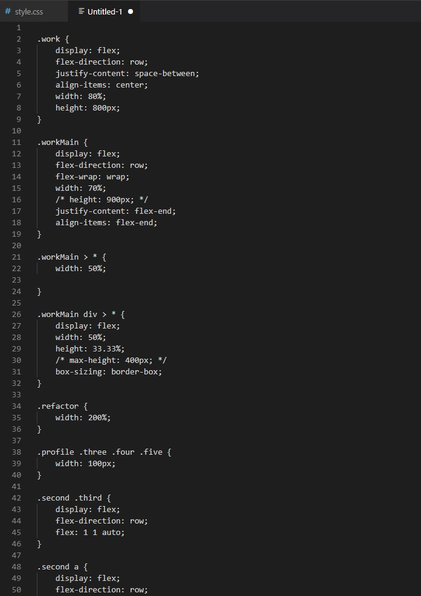

# shawn_fox_portfolio
My personal portfolio to be updated as I continue my learning.

## Author:

Shawn Fox

| [GitHub](https://github.com/SFoxGit) | [Email](sfoxss4@gmail.com) |

---
## Project Links:

- Deployed site: [GitHub Pages](https://sfoxgit.github.io/shawn_fox_portfolio/)
- GitHub: [SFoxGit](https://github.com/SFoxGit/shawn_fox_portfolio)

---
## Table of Contents

- [Description](##Description)

- [Requirements](##Requirements)

- [Progress](##Progress)

- [Installation](##Installation)

- [Contributions](##Contributing)

- [Credits](##Credits)

---
## Description

My first coding portfolio.

Designed with employers in mind!

---
## Requirements

### Must include:

    - Name

    - Photo

    - Links to 

    - Sections about me

    - My work

    - Contact information

    - Nav links UI scrolls to corresponding section

    - My work section must have titled images of my applications

    - My first project must be a larger image than the rest

    - Clicking on image links to deployed application

    - Page must be adaptive to to various screen sizes
    
---
## Progress

Stage 1: Planning

I was provided an example criteria for layout purposes. In google slides I did a rough draft of it to ease the process when it comes to html and css.

Stage 2: Basic html framework

Sectioning off each area based off the layout above, this will make the css so much easier when it's time to flex!

Stage 3: Content

A challenging part for me is filling in the content, I am currently a week into my coding bootcamp so I don't have a lot of projects. I'll use fillers to start. 

Tested the using image as a link, worked great! (probably should be focusing on filling out the content though)

Stage 4: CSS

I had to fully delete all my css for the work section multiple times. Flexbox was giving me dificulties. It's now in a good place but a quick look at the carnage as the mistakes were compounding:

Side note, why would I include this? Isn't it embarassing? No, this is showing my ability to rebound. To use my resources to get to the right answer. 

I also know I could have done things way easier by doing the images of the work section in background, but I wanted to challenge myself and include them in the link itself.

Stage 5: Testing code

My nav links weren't working because I used section class instead of id, then my css wasn't working because I used . instead of #. Quick fix, just a big scare.

Stage 6: Fixing

I had a lot to fix, and there is a lot more I will be fixing in the future. I'm not happy with how ineffecient my css, especially in comparison to my horiseon refactor. This is not the end, mearly the end of the beginning. 

Desktop version:

Mobile version:

Stage 7: Scrap it

I went through and redid this with bootstrap, because bootstrap is awesome. Updated some projects and added some new features. Trying to think of some fun javascript to add. Check back later!

---
## Installation

Deployed product can be viewed [here.](https://sfoxgit.github.io/shawn_fox_portfolio/)

---
## Contributing

Feel free to contact me with suggestions!

---
## Credits

- Hero image: Tomáš Malík via pexels.com [Instagram](https://www.instagram.com/tomas_malco_malik)

- Work Three: [Oleg Magni](https://www.pexels.com/@oleg-magni) via pexels.com

- Work Four: [Markus Spiske](https://www.pexels.com/@markusspiske) via pexels.com

- Work Five: [Maria Orlova](https://www.pexels.com/@orlovamaria) via pexels.com

- Icon: [Yaroslav Shuraev](https://www.pexels.com/@yaroslav-shuraev) via pexels.com
